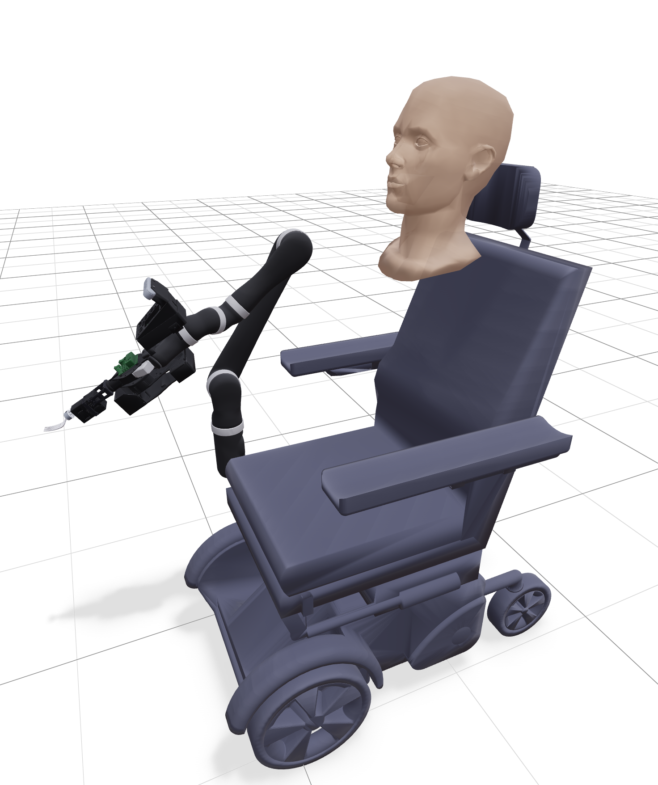

# ada_assets

MuJoCo models for the ADA robot-assisted feeding system.

ADA is a Kinova JACO2 arm mounted on a Permobil wheelchair, with a seated human user, wrist-mounted Intel RealSense D415 camera, and an interchangeable tool (articutool or forque). This package provides composable MuJoCo XML components and a Python assembly API that builds the full scene programmatically.



## Installation

```bash
uv pip install -e .
```

Dependencies: `mujoco`. For viewing, install [mj_viser](https://github.com/personalrobotics/mj_viser).

## Quick start

```python
from ada_assets.assembly import assemble_ada

# Default: wheelchair + JACO2 + camera + human + articutool with fork
model, data = assemble_ada()
```

View it:

```bash
uv run python -m ada_assets.assembly --view
```

## Assembly options

The `assemble_ada()` function composes the full scene from components:

```python
# Default — all components, articutool with fork tip
model, data = assemble_ada()

# Articutool with spoon tip
model, data = assemble_ada(tool_tip="spoon")

# Forque (rigid fork, no motors)
model, data = assemble_ada(tool="forque")

# No tool
model, data = assemble_ada(tool=None)

# No camera
model, data = assemble_ada(with_camera=False)

# No human
model, data = assemble_ada(with_human=False)

# No floor/lighting (for embedding in a larger scene)
model, data = assemble_ada(with_floor=False)
```

CLI:

```bash
uv run python -m ada_assets.assembly --view                              # default
uv run python -m ada_assets.assembly --view --tool-tip spoon             # spoon
uv run python -m ada_assets.assembly --view --tool forque                # forque
uv run python -m ada_assets.assembly --view --no-tool                    # bare arm
uv run python -m ada_assets.assembly --save assembled.xml                # save XML
```

## Components

Each component is a standalone MuJoCo XML that can be loaded independently or composed via the assembly API. All meshes live in a single flat `models/assets/` directory.

### JACO2 arm (`jaco2.xml`)

Kinova JACO2 j2n6s200 — 6-DOF arm with 2 underactuated fingers.

- **Joints**: 6 revolute (arm) + 2 revolute per finger (proximal + distal with spring)
- **Actuators**: 6 arm + 2 finger position servos
- **Fingers**: Tendon-coupled underactuated mechanism. Proximal and distal joints linked by a fixed tendon (coef 1.0 proximal, 0.5 distal). Distal has a return spring — when the proximal is blocked by contact, force transfers to the distal via the tendon, wrapping around the object.
- **Materials**: Carbon fiber (arm links), brushed aluminum (rings), rubber (finger pads) — from the original DAE files.
- **Gravity compensation**: Enabled on all moving bodies (`gravcomp="1"`)
- **Effort limits**: From URDF — J1/J3 ±40 Nm, J2 ±80 Nm, J4-6 ±20 Nm, fingers ±2 Nm
- **Sites**: `base_mount_site`, `tool_attachment_site`, `ee_site`, `forque_attachment_site`, `articutool_attachment_site`, `camera_attachment_site`
- **Keyframes**: `above_plate`, `resting`, `staging`, `stow`, `open` (fingers)

### Wheelchair (`wheelchair.xml`)

Permobil wheelchair — static body with visual and collision meshes.

- **Position**: `z = 0.4612` (from physics drop test — wheels on floor)
- **Site**: `arm_attachment_site` at the JACO2 mounting point

### Seated human (`seated.xml`)

Seated user on the wheelchair — body collision envelope and head with mouth target.

- **Body collision**: `body_collision_in_wheelchair.stl` safety envelope at wheelchair height
- **Head**: Mocap body (6-DOF, controllable via `data.mocap_pos`/`data.mocap_quat`). Visual mesh from `tom.stl`, collision box sized to mesh bounds.
- **Mouth site**: Feeding target at `pos="0.02 0 0"` in head frame. On the real robot this comes from face detection — in sim, move the head mocap body.
- **Face wall**: Thin collision box in front of the face, child of head (tracks head movement). Initially disabled (`contype=0`) — enable at runtime for safety testing.

### Wrist camera (`camera.xml`)

[Intel RealSense D415](https://www.intel.com/content/www/us/en/products/sku/128256/intel-realsense-depth-camera-d415/specifications.html) on a Jetson Nano enclosure, mounted on JACO2 link_6.

- **Assembly**: Arm mount → enclosure (bottom + top + front stabilizer) → Jetson Nano → camera back mount → D415
- **Extrinsics**: Calibrated transform from `cameraMount` to `camera_link` (from `ada.xacro` hard-coded extrinsics)
- **Cameras**: `d415_color` and `d415_depth` MuJoCo cameras at the calibrated `color_optical_frame`
- **Color**: 1280x720, fovy=43° (from nominal fy=911)
- **Depth**: Same frame (aligned_depth_to_color), clip to [0.16, 10.0] m in post-processing
- **Nominal intrinsics** (1280x720): fx=913.16, fy=911.31, cx=635.49, cy=372.79
- **Sites**: `camera_link` (calibrated extrinsics frame), `color_optical_frame` (OpenCV convention: z into scene)
- **Limitations**: MuJoCo only supports `fovy` — off-center principal point and non-square pixels require post-processing (see [ada_mj#5](https://github.com/personalrobotics/ada_mj/issues/5))

### Articutool (`articutool.xml`) — default tool

2-DOF motorized fork/spoon end-effector with F/T sensor and IMU.

- **Joints**: `atool_joint1` (tilt, ±π/2) and `atool_joint2` (roll, ±π)
- **Motors**: [Dynamixel XC430-W250-T](https://emanual.robotis.com/docs/en/dxl/x/xc430-w250/), stall torque 1.4 Nm, position-controlled with forcerange clamping
- **F/T sensor**: [Resense Hex21](https://www.resense.io/fileadmin/06-Downloads/Resense/Flyer/Resense-Flyer-F_T-Sensor-hex21.pdf) (±50 N force, ±0.5 Nm torque, 1% accuracy)
- **IMU**: [TDK ICM-20948](https://product.tdk.com/system/files/dam/doc/product/sensor/mortion-inertial/imu/data_sheet/ds-000189-icm-20948-v1.5.pdf) 9-axis (accelerometer + gyro) on the handle — used to keep tool tip level during transport
- **Tool tips**: Fork (`fork_tool.stl`) or spoon (`spoon_tool.stl`), swappable via `tool_tip` parameter
- **Grasp**: Freejoint object, held by a weld constraint (`articutool_grasp_weld`). Disable to release:
  ```python
  eq_id = mujoco.mj_name2id(model, mujoco.mjtObj.mjOBJ_EQUALITY, "articutool_grasp_weld")
  model.eq_active[eq_id] = 0  # release
  ```
- **Sites**: `grasp_site` (weld point), `imu_site`, `ft_sensor_site`, `fork_tip` (feeding contact)
- **Sensors**: `ft_force`, `ft_torque`, `imu_accel`, `imu_gyro`

### Forque (`forque.xml`) — alternative tool

Rigid fork with ATI Nano25-E F/T sensor, no motors. The simpler predecessor to the articutool.

- **No actuated joints** — fork tine is rigidly connected to the sensor body
- **F/T sensor**: [ATI Nano25-E](https://www.ati-ia.com/products/ft/ft_models.aspx?id=Nano25) (±125 N force, ±3 Nm torque, noise 0.06 N / 0.003 Nm)
- **Grasp**: Same freejoint + weld pattern as articutool (`forque_grasp_weld`)
- **Sites**: `grasp_site`, `ft_sensor_site`, `fork_tip`
- **Sensors**: `ft_force`, `ft_torque`

## How assembly works

The Python assembly (`assembly.py`) uses MuJoCo's `MjSpec` API:

1. Load wheelchair as the base spec
2. Attach JACO2 at `arm_attachment_site` via `spec.attach()`
3. Attach wrist camera at `camera_attachment_site` on link_6
4. Attach seated human on worldbody
5. Attach tool (articutool or forque) on worldbody as a freejoint object
6. Add a weld equality constraint from the tool's `grasp_site` to the attachment site on link_6
7. Initialize the tool's freejoint qpos to the attachment site pose so it starts in the hand
8. Add floor and lighting

Each component XML has no `meshdir` — the assembly sets it once to the shared `assets/` directory.

## Loading individual components

```python
from ada_assets import MODELS_DIR, ASSETS_DIR
import mujoco

# Load a single component
spec = mujoco.MjSpec.from_file(str(MODELS_DIR / "jaco2.xml"))
spec.meshdir = str(ASSETS_DIR)
model = spec.compile()
```

Or use the helper:

```python
from ada_assets import get_model_path, ASSETS_DIR

path = get_model_path("jaco2")  # returns Path to jaco2.xml
```

## Project structure

```
ada_assets/
├── src/ada_assets/
│   ├── __init__.py          # MODELS_DIR, ASSETS_DIR, get_model_path()
│   ├── assembly.py          # assemble_ada() + CLI
│   └── models/
│       ├── jaco2.xml        # JACO2 arm
│       ├── wheelchair.xml   # Permobil wheelchair
│       ├── seated.xml       # Seated human
│       ├── articutool.xml   # 2-DOF motorized tool
│       ├── forque.xml       # Rigid fork + F/T sensor
│       ├── camera.xml       # Wrist camera (D415 + Jetson Nano)
│       ├── ada.xml          # Include-based assembly (for reference)
│       ├── scene.xml        # Full scene with floor/lighting
│       └── assets/          # 41 STL mesh files (single flat directory)
├── pyproject.toml
├── LICENSE
└── README.md
```

## Source data

All transforms, inertials, joint limits, and mesh files are traced to their original sources:

- **JACO2 arm**: [Kinova JACO2 j2n6s200](https://www.kinovarobotics.com/product/jaco2-702), `ada_ros2/ada_description/urdf/j2n6s200.xacro` + DAE meshes for materials
- **Wheelchair**: `ada_feeding/ada_planning_scene` + physics drop test for z-height
- **Seated human**: `ada_feeding/ada_planning_scene` config (positions converted from arm-root frame to floor frame)
- **Forque**: `ada_ros2/ada_description/urdf/forque/forque.xacro`
- **Articutool**: `articutool_ros2/articutool_description/urdf/articutool.xacro`
- **Wrist camera**: `ada_ros2/ada_description/urdf/camera/camera.xacro` + `d415urdf.xacro`, extrinsics from `ada.xacro`
- **Sensor specs**: [ATI Nano25-E](https://www.ati-ia.com/products/ft/ft_models.aspx?id=Nano25), [Resense Hex21](https://www.resense.io/fileadmin/06-Downloads/Resense/Flyer/Resense-Flyer-F_T-Sensor-hex21.pdf), [TDK ICM-20948](https://product.tdk.com/system/files/dam/doc/product/sensor/mortion-inertial/imu/data_sheet/ds-000189-icm-20948-v1.5.pdf), [Intel D415](https://www.intel.com/content/www/us/en/products/sku/128256/intel-realsense-depth-camera-d415/specifications.html)

## Integration notes (ada_mj)

The tool weld is a **mechanical attachment**, not a grasp. Key design decisions for the robot controller (see [ada_mj#4](https://github.com/personalrobotics/ada_mj/issues/4)):

- **GraspManager does not manage tools.** The weld constraint is pre-built by `assemble_ada()`. GraspManager handles physics-based grasps (finger contact on food, cans, etc.).
- **Exclude tool from Environment.** The tool is a freejoint body but should not appear in the scene object list when welded — it's kinematically part of the arm.
- **Collision filtering.** When welded, treat tool bodies as arm bodies. When released, they become regular scene objects.
- **F/T sensor requires the weld.** Kinematic attachment (qpos updates) bypasses the constraint solver — F/T sensors read zero. The weld creates real constraint forces.

## Known issues

- `ft_sensor_site` position on the forque needs verification against the ATI Nano25-E gage origin from the datasheet drawing (currently at mesh midplane)
- Articutool attachment transform derived from composed URDF frames — visual alignment confirmed but should be verified on hardware
